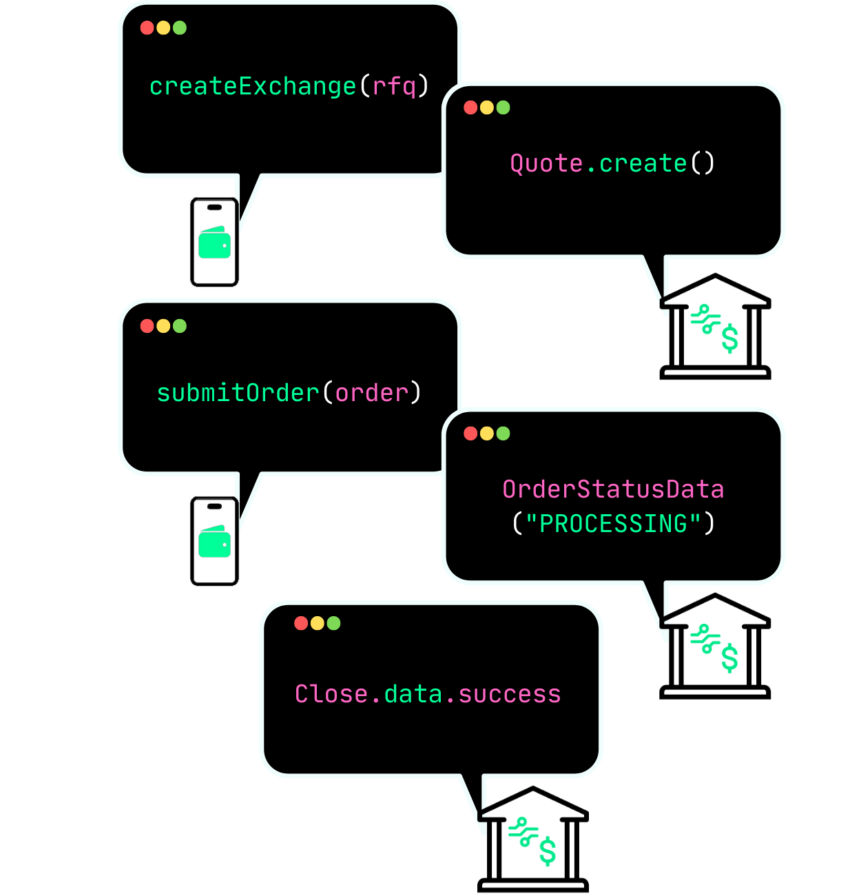

# NomadCover wallet

NomadCover wallet is a cross-border travel insurance app for iOS designed to provide comprehensive coverage for frequent travelers across Africa. Leveraging the tbDEX protocol, NomadCover offers a seamless experience for purchasing insurance, managing claims, and handling multi-currency transactions.

tbDex_Message Workflow image

